# pi-go Architecture

## Overview

pi-go is a coding agent built on [Google ADK Go](https://google.golang.org/adk) with multi-provider LLM support, sandboxed tool execution, session persistence, an interactive terminal UI, optional LSP integration, and a subagent orchestration system.

## Package Structure

```
pi-go/
├── cmd/pi/main.go                  # Entry point → cli.Execute()
└── internal/
    ├── agent/                       # ADK agent setup, retry logic
    ├── audit/                       # Hidden character scanner for skill audit
    ├── auth/                        # OAuth PKCE/device-code login flows
    ├── cli/                         # CLI flags, output modes, wiring
    ├── config/                      # Config loading (global + project), model roles
    ├── extension/                    # Hooks, skills, MCP integration
    ├── guardrail/                    # Daily token usage tracking and limits
    ├── lsp/                         # Optional LSP integration (protocol, client, manager, languages, hooks)
    ├── logger/                      # Session logging to ~/.pi-go/log/
    ├── memory/                      # Optional persistent memory subsystem (not wired into default startup)
    ├── provider/                    # LLM providers (Anthropic, OpenAI, Gemini)
    ├── rpc/                         # Unix socket JSON-RPC server
    ├── session/                     # JSONL persistence, branching, compaction
    ├── tools/                       # Sandboxed tools (read, write, edit, bash, grep, find, ls, tree, git) plus optional LSP helpers
    └── tui/                         # Bubble Tea v2 interactive UI
```

## Dependency Graph

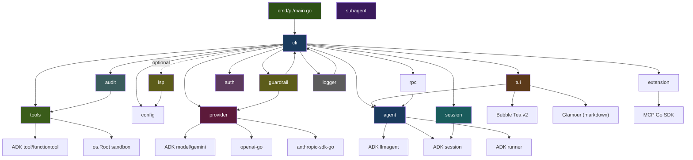

## Request Flow

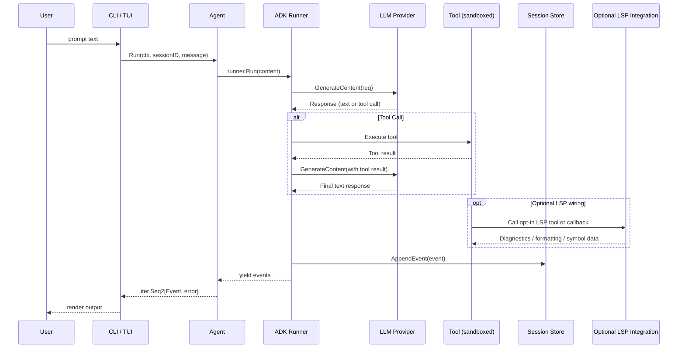

## Tool System

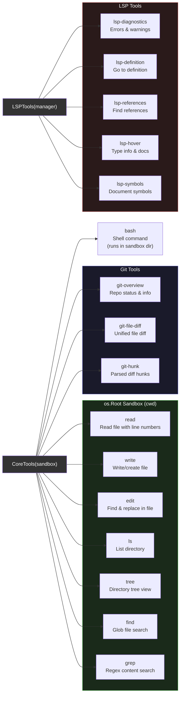

All file tools operate through the `Sandbox` which uses Go's `os.Root` to restrict access to the working directory tree. Paths cannot escape via `..` or symlinks.

| Tool | Input | Output | Limits |
|------|-------|--------|--------|
| read | file_path, offset, limit | content, total_lines | 2000 lines default, 100KB |
| write | file_path, content | path, bytes_written | Auto-creates parent dirs |
| edit | file_path, old_string, new_string | path, replacements | Unique match required |
| bash | command, timeout | stdout, stderr, exit_code | 2min default, 10min max |
| grep | pattern, path, glob | matches, total_matches | 200 matches max |
| find | pattern, path | files, total_files | 500 results max |
| ls | path | entries (name, is_dir, size) | — |
| tree | path, depth | tree, dirs, files | Depth 10 max, 500 entries |
| git-overview | — | branch, commits, staged, unstaged, untracked | 10s timeout |
| git-file-diff | file, staged | diff | 10s timeout |
| git-hunk | file, staged | hunks (header, content, lines) | 10s timeout |

## Model Roles

The model roles system maps abstract role names to specific LLM models, enabling different components to use appropriate models for their task complexity.

```
config.json:
{
  "roles": {
    "default": { "model": "claude-sonnet-4-20250514" },
    "smol":    { "model": "claude-haiku-3-20240307" },
    "plan":    { "model": "claude-sonnet-4-20250514" },
    "slow":    { "model": "claude-opus-4-20250514" }
  }
}
```

`ResolveRole(role)` resolves a role name to a model and provider. Falls back to "default" role if the requested role is not configured. The provider is auto-detected from the model name prefix (claude→anthropic, gpt/o1-4→openai, gemini→gemini).

CLI flags `--smol`, `--plan`, `--slow` override the active role for a single invocation.

## Optional LSP Integration

The LSP system remains available in-tree, but it is no longer part of default core startup. Extensions or custom startup code can opt in to two pieces:

**Hooks** (opt-in, via `BuildLSPAfterToolCallback`):
- **Format-on-write**: After `write` tool calls, requests formatting from the language server and applies edits (5s timeout)
- **Diagnostics-on-edit**: After file modifications, collects compiler errors/warnings with a 2s delay for server processing

**Explicit tools** (opt-in, via `tools.LSPTools`):
- `lsp-diagnostics` — Get errors and warnings for a file
- `lsp-definition` — Go to definition of symbol at position
- `lsp-references` — Find all references to a symbol
- `lsp-hover` — Get type information and documentation
- `lsp-symbols` — List all symbols in a file

The `Manager` starts language servers on demand based on file extension, caches connections, and shuts them down on exit. Supported languages: Go (gopls), TypeScript (typescript-language-server), Python (pylsp), Rust (rust-analyzer).

## Provider System

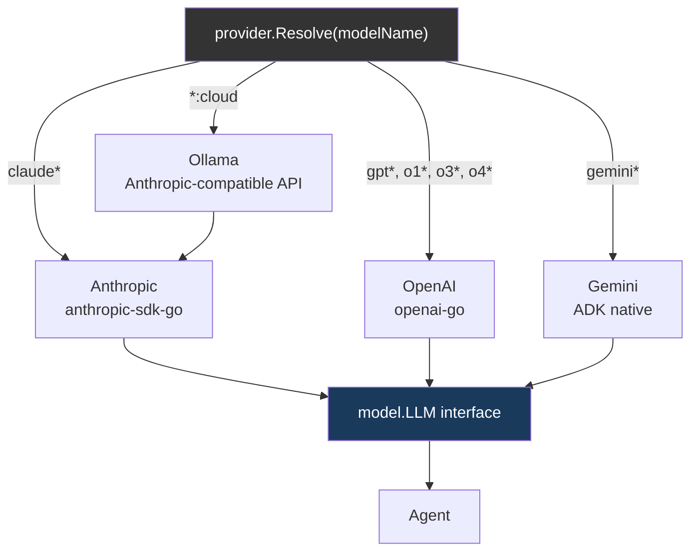

Each provider implements the ADK `model.LLM` interface:

```go
type LLM interface {
    Name() string
    GenerateContent(ctx, req *LLMRequest, stream bool) iter.Seq2[*LLMResponse, error]
}
```

**API keys** from environment: `ANTHROPIC_API_KEY`, `OPENAI_API_KEY`, `GOOGLE_API_KEY`
**Base URLs** from environment: `ANTHROPIC_BASE_URL`, `OPENAI_BASE_URL`, `GEMINI_BASE_URL`

## Session Management

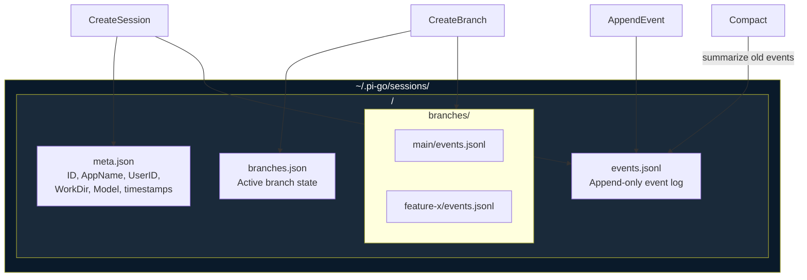

- **Persistence**: JSONL append-only event log per session
- **Branching**: Fork conversations, switch between branches
- **Compaction**: Replace old events with summary when token count exceeds threshold
- **Resume**: `--continue` resumes last session, `--session <id>` resumes specific session

## Output Modes

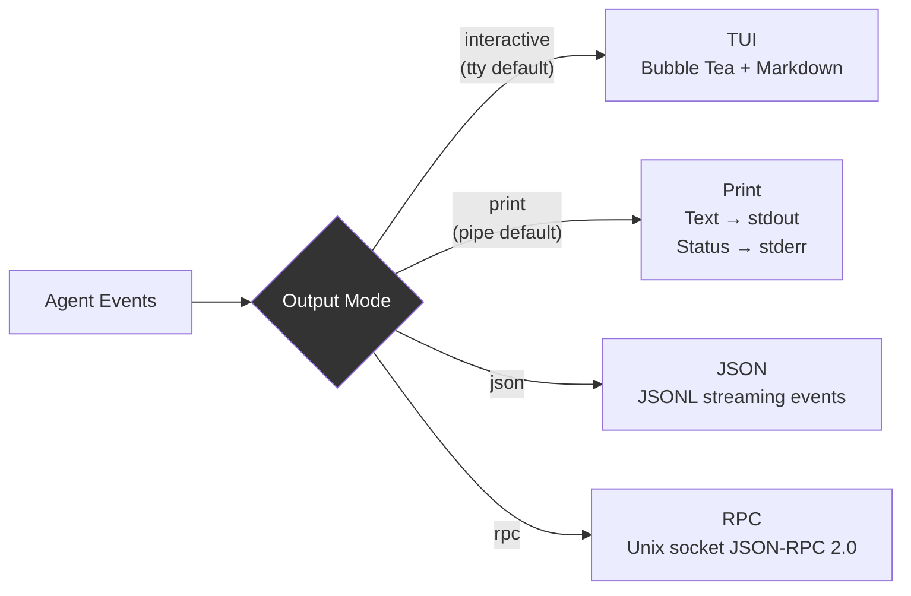

**JSON event types**: `message_start`, `text_delta`, `tool_call`, `tool_result`, `message_end`

## Extension System

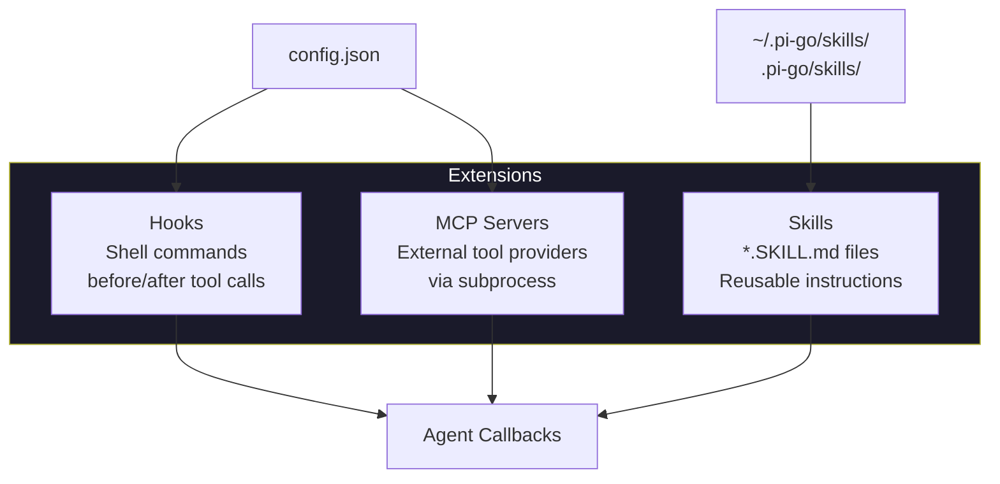

**Hooks**: Execute shell commands before/after tool execution. Tool name + args/results passed as JSON on stdin.

**Skills**: Markdown instruction files with YAML frontmatter. Loaded from global and project directories.

**MCP**: Launch external tool servers as subprocesses. Tools bridged into agent's toolset via ADK.

## Configuration

```
~/.pi-go/config.json          # Global config
.pi-go/config.json             # Project config (overrides global)
.pi-go/AGENTS.md               # Project-specific agent instructions
~/.pi-go/skills/*.SKILL.md     # Global skills
.pi-go/skills/*.SKILL.md       # Project skills (override global)
~/.pi-go/sessions/             # Session storage
~/.pi-go/log/                  # Session logs
~/.pi-go/.env                  # API keys (written by /login)
~/.pi-go/usage.json            # Daily token usage
```

Planning and SOP directories are no longer part of core configuration. Any spec-driven or SOP-driven workflow is expected to come from extensions, prompts, or external packages.

**Configuration schema** (`config.json`):
```json
{
  "roles": { "default": {...}, "smol": {...} },
  "hooks": [...],
  "mcp": { "servers": [...] },
  "maxDailyTokens": 0,
  "compactor": { "enabled": true }
}
```

## Initialization Flow

The TUI uses a **deferred initialization** pattern to show the UI immediately while initializing subsystems in the background:

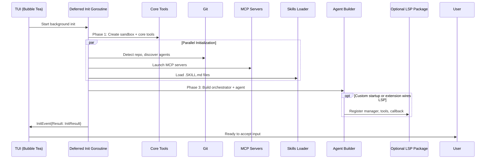

**Key patterns:**
- TUI starts immediately with spinner showing initialization progress
- Heavy I/O operations run in parallel (git, MCP, skills)
- Agent is created last after all default-core dependencies are ready
- LSP is available for opt-in wiring, but is not part of deferred init by default
- Progress sent via `InitEvent` channel

## Retry & Error Handling

```mermaid
graph TD
    call["LLM Call"] --> check{Error?}
    check -->|No| done["Success"]
    check -->|Yes| transient{Transient?}
    transient -->|"429, 5xx,<br/>timeout, reset"| retry["Wait (exp backoff)<br/>1s → 2s → 4s"]
    transient -->|"400, auth,<br/>other"| fail["Fail immediately"]
    retry --> attempt{Retries<br/>exhausted?}
    attempt -->|No| call
    attempt -->|Yes| fail

    style retry fill:#5c5c1a,color:#fff
    style fail fill:#5c1a1a,color:#fff
    style done fill:#1a5c1a,color:#fff
```

Defaults: 3 retries, 1s initial delay, 30s max delay. Partial results prevent retry to preserve data integrity.

## TUI Architecture

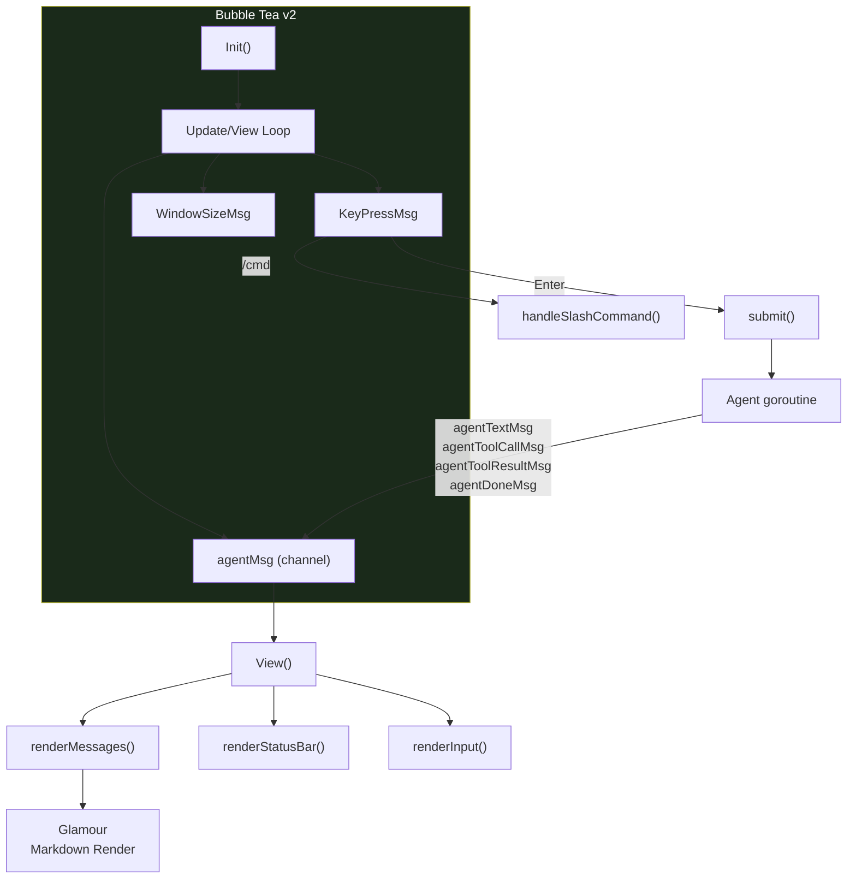

**Slash commands**: `/help`, `/clear`, `/model`, `/session`, `/context`, `/branch`, `/compact`, `/commit`, `/agents`, `/history`, `/login`, `/skills`, `/theme`, `/rtk`, `/ping`, `/restart`, `/exit`, `/quit`

**Keyboard**: Enter (submit), Ctrl+C/Esc (quit), Up/Down (history), PgUp/PgDown (scroll), Enter/Esc (commit confirm/cancel)

## Guardrail System

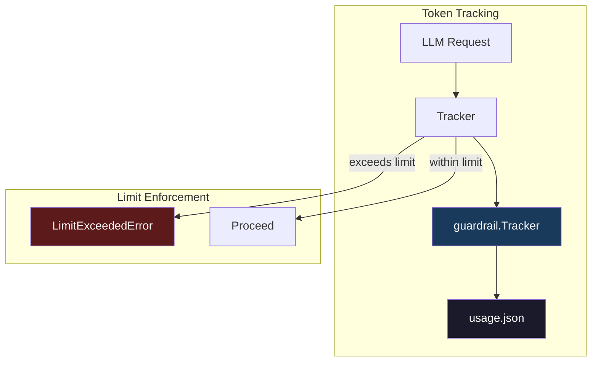

**Features:**
- **Daily token tracking**: Input/output tokens, request count
- **Configurable limits**: Set via `maxDailyTokens` in config
- **Persistent storage**: `~/.pi-go/usage.json` (resets at midnight)
- **Usage formatting**: Human-readable summaries with percentages

**API:**
```go
type Tracker struct {
    limit int64 // max tokens/day (0 = unlimited)
    usage Usage
}
func (t *Tracker) Add(inputTokens, outputTokens int32) error
func (t *Tracker) Check() error
func (t *Tracker) Remaining() int64
func (t *Tracker) PercentUsed() float64
```

## Authentication System

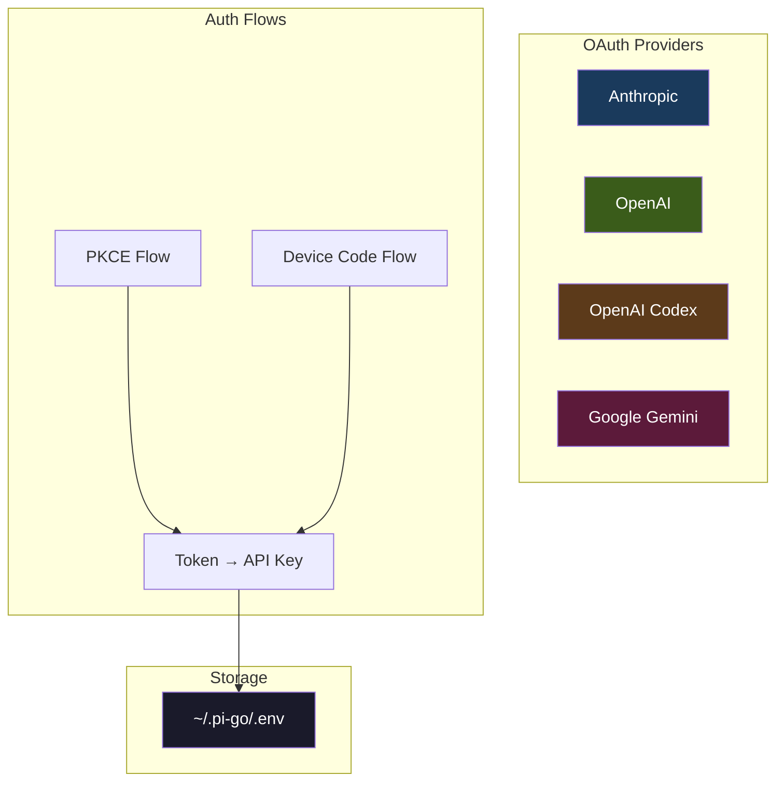

**Features:**
- **OAuth PKCE flow**: Browser-based authorization for Anthropic, Google
- **Device code flow**: CLI-friendly flow for OpenAI
- **TLS preflight**: Detects certificate chain issues for OpenAI OAuth
- **Key storage**: Saves API keys to `~/.pi-go/.env`

**CLI command**: `/login [provider]` in TUI

## Audit System

```mermaid
graph TD
    subgraph Scan["Hidden Character Scanner"]
        files["Files"] --> scanner["Scanner"]
        scanner --> findings["ScanFinding[]"]
    end

    subgraph Severity["Severity Levels"]
        findings -->|U+200B-ZWSP| critical["SeverityCritical"]
        findings -->|U+2028/29|LTR| warning["SeverityWarning"]
        findings -->|ZWJ/emoji| info["SeverityInfo"]
    end

    subgraph Output["Output Formats"]
        findings --> text["Text Table"]
        findings --> json["JSON"]
        findings --> markdown["Markdown Table"]
    end

    style scanner fill:#3a5c5c,color:#fff
```

**Features:**
- **Hidden character detection**: ZWSP, LTR marks, BOM, soft hyphens, etc.
- **Smart context**: ZWJ between emoji downgraded to info
- **Auto-fix**: `StripDangerous()` removes critical/warning chars
- **Skill auditing**: `ScanSkillDirs()` audits all skills

**Severity levels:**
| Level | Characters | Exit Code |
|-------|------------|-----------|
| Critical | U+200B-200F (ZWSP, LTR marks) | 1 |
| Warning | U+2028/29, U+00AD, etc. | 2 |
| Info | ZWJ in emoji, BOM at start | 0 |

## Logger System

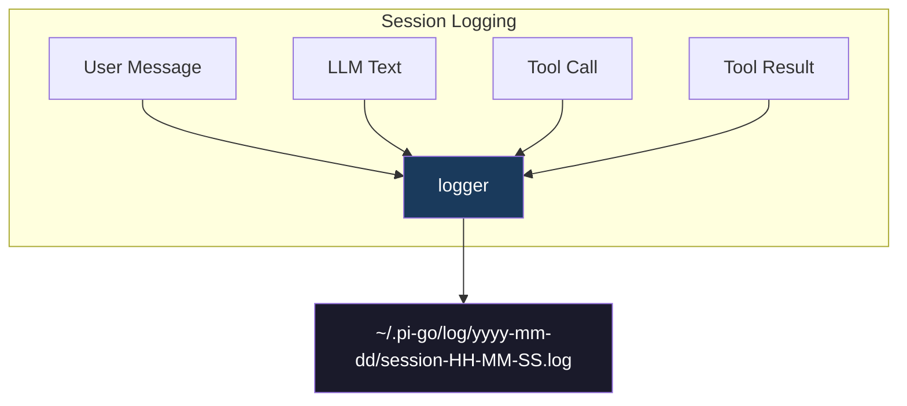

**Features:**
- **Structured JSON logs**: Machine-parseable event log
- **Entry types**: `session_start`, `user`, `llm_text`, `tool_call`, `tool_result`, `error`, `info`
- **File location**: `~/.pi-go/log/YYYY-MM-DD/session-HH-MM-SS.log`
- **Session metadata**: Session ID, model name, mode recorded at start

## Planning and workflow guidance

Planning workflows and subagent orchestration are no longer built into core. pi-go's core provides a generic chat TUI, tools, skills, extensions, and model roles; any spec-driven workflows or multi-agent orchestration should be layered on through prompts, skills, extensions, or external packages.

## Memory System

`internal/memory/` and the `mem-search` / `mem-timeline` / `mem-get` tools still exist in-tree, but they are no longer part of the default core bootstrap path.

Current core behavior:
- startup does **not** open a SQLite memory database
- startup does **not** start compression/background memory workers
- startup does **not** inject memory context into the base system prompt
- default tool registration does **not** expose memory search tools

If persistent memory returns in the future, it should be wired in explicitly as an optional subsystem or extension rather than assumed by core.
