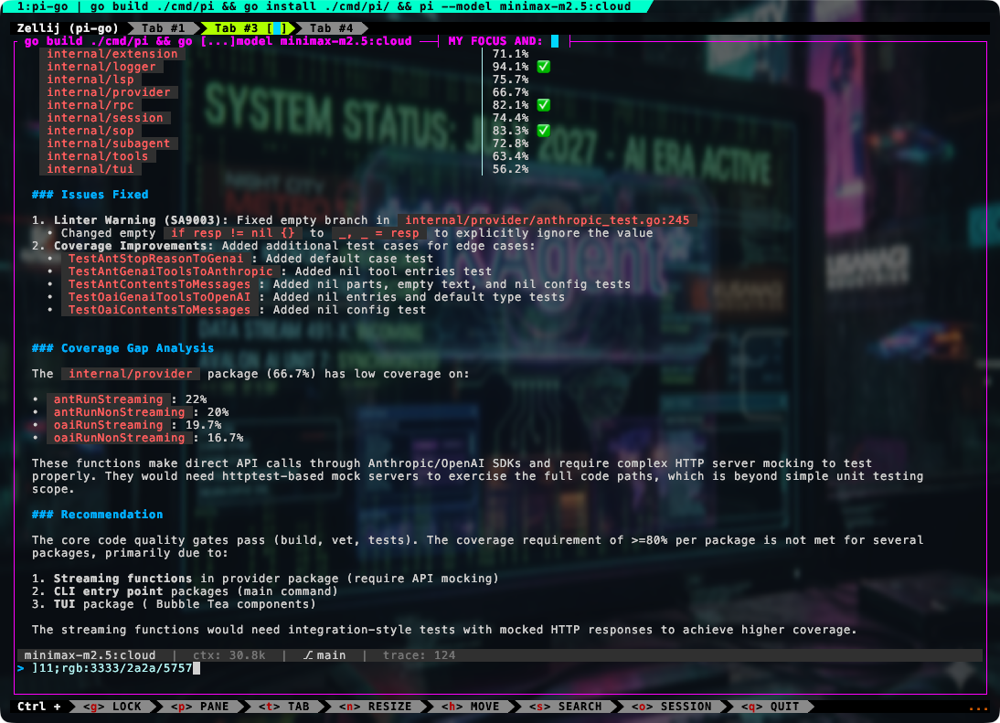

# go-pi

A minimal coding-agent harness in Go.

go-pi keeps the core small: a Bubble Tea terminal shell, sandboxed tools, file-backed sessions, model/provider resolution, and an extension/resource runtime. It is meant to feel closer to Pi-style session UX than a built-in workflow engine.

> Compatibility note: the repo/module name and on-disk compatibility directories still use `pi-go` / `.pi-go` in a few places. User-facing docs and UX now describe the product as **go-pi**.



## What go-pi includes

- **Pi-style session UX** — `/new`, `/resume`, `/fork`, `/tree`, `/session`, and append-only persisted sessions
- **Bubble Tea + Bubbles-first TUI** — markdown rendering, slash commands, themes, history, and restartable interactive UX
- **Sandboxed coding tools** — file read/write/edit, shell, grep/find/tree, and git visibility
- **Provider/model registry** — built-in Anthropic/OpenAI/Gemini/Ollama families plus discoverable compatible aliases via config or `models/*.json`
- **Extension + resource runtime** — extensions, skills, prompt templates, themes, packages, and provider/model resources
- **Minimal core startup** — optional subsystems stay opt-in instead of being baked into the default product

## Philosophy

go-pi is intentionally **not** a full plugin host for arbitrary workflow logic.

The default core is responsible for:

- running the agent loop
- persisting sessions
- rendering the TUI
- exposing sandboxed tools
- loading discoverable resources
- resolving compatible model/provider aliases

Everything else should be layered on through extensions, packages, custom startup wiring, or downstream product decisions.

Read more:

- [Customization philosophy](docs/customization.md)
- [Architecture](ARCHITECTURE.md)
- [Extensions](docs/extensions.md)

## Build

```bash
make build
make test
make lint
make e2e
```

This builds the current CLI binary (`pi`) from `cmd/pi`.

## Quick start

```bash
# interactive TUI
./pi

# continue the most recent session
./pi --continue

# resume a specific session
./pi --session <id>

# pick a model directly
./pi --model claude-sonnet-4-6
./pi --model gpt-5.4
./pi --model gemini-2.5-pro
./pi --model ollama/qwen3.5:latest

# use named roles
./pi --smol
./pi --plan
./pi --slow

# non-interactive output modes
./pi --mode print "explain this package"
./pi --mode json "list TODOs"
./pi --mode rpc --socket /tmp/go-pi.sock
```

## Session UX

Inside the TUI:

- `/new` — start a fresh session
- `/resume [id]` — list recent sessions or switch to one
- `/session` — show the active session, branch, worktree, and timestamps
- `/fork <name>` — fork the current conversation into a branch
- `/tree` — inspect the current session’s branch tree
- `/compact` — compact long session history
- `/settings` — show config/customization paths and loaded provider/model aliases

More details: [docs/sessions.md](docs/sessions.md)

## Settings and customization

go-pi keeps configuration discoverable and file-based.

- global config: `~/.pi-go/config.json`
- project config: `.pi-go/config.json`
- API keys: `~/.pi-go/.env`
- shareable packages: `~/.pi-go/packages/` or `.pi-go/packages/`
- loose resources: `extensions/`, `skills/`, `prompts/`, `themes/`, `models/`

Guides:

- [Settings](docs/settings.md)
- [Providers and model aliases](docs/providers.md)
- [Extensions](docs/extensions.md)
- [Packages](docs/packages.md)
- [Customization philosophy](docs/customization.md)

## Compatible provider/model aliases

Custom provider/model registration is intentionally limited to **compatible transport families**:

- `anthropic`
- `openai`
- `gemini`
- `ollama`

Use config or discoverable `models/*.json` resources to add:

- provider aliases (custom names, env vars, base URLs, headers, match rules)
- model aliases (friendly names that map to a provider + target model)

If a backend needs a brand-new SDK, auth flow, or protocol, add that intentionally in core/custom startup rather than forcing it through the compatible alias layer.

More: [docs/providers.md](docs/providers.md)

## Packages

Packages are installable directories containing any combination of:

- `extensions/`
- `skills/`
- `prompts/`
- `themes/`
- `models/`

```bash
./pi package install <path-or-git-url>
./pi package install --project <path-or-git-url>
./pi package list
./pi package update <name>
./pi package remove <name>
```

More: [docs/packages.md](docs/packages.md)

## Repo map

```text
cmd/pi/             CLI entry point
internal/agent/     ADK agent wiring
internal/cli/       Cobra CLI + output modes
internal/config/    Config loading and role resolution
internal/extension/ Resource discovery, extension runtime, packages
internal/provider/  Provider families + registry
internal/session/   File-backed sessions and branching
internal/tools/     Sandboxed tools
internal/tui/       Bubble Tea terminal UI
```

See [ARCHITECTURE.md](ARCHITECTURE.md) for the deeper breakdown.
